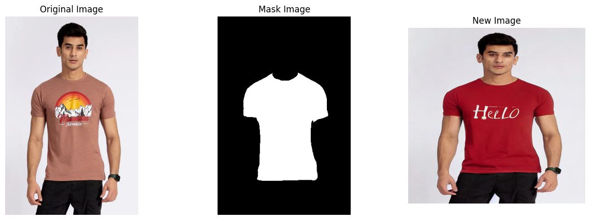
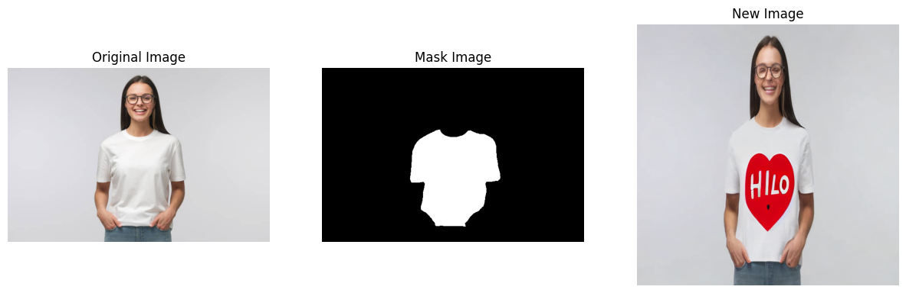

# Text-Based Virtual Try-On with Stable Diffusion Inpainting

## Project Overview

In this project, I have used Stable Diffusion inpainting to create a text-based virtual try-on system. By utilizing prompt-based cloth segmentation, users can dynamically customize clothing designs and colors. The model segments the clothing and applies new designs based on textual prompts, allowing for interactive virtual fittings.

## Features

- **Text-Based Customization:** Users can change clothing designs and colors using simple text prompts.
- **Cloth Segmentation:** The model accurately segments clothing items for seamless design application.

## Demo Results
Here are some examples of the results generated by the system:

